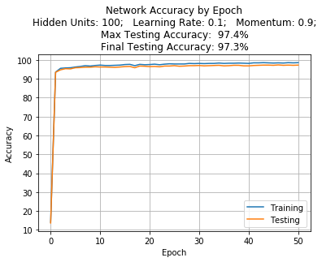

# Machine Learning Homework 2
### Spencer Hann
### CS 545 | Winter 2019
### Dr. Melanie Mitchell

## Version information


```python
import cython
import numpy as np
import sys
import pandas

print("Python:",sys.version)
print("NumPy: ",np.__version__)
print("Pandas:",pandas.__version__)
print("Cython:",cython.__version__)
```

    Python: 3.6.7 (default, Oct 22 2018, 11:32:17) 
    [GCC 8.2.0]
    NumPy:  1.16.0
    Pandas: 0.23.4
    Cython: 0.29


## Loading and Prepocessing Mnist Data


```python
%load_ext cython
```


```cython
%%cython
import numpy as np
cimport numpy as np

def preprocess_data(filename, max_rows=None):
    cdef np.ndarray targets;
    cdef np.ndarray data = np.genfromtxt(filename, delimiter=',', max_rows=max_rows)

#     np.random.shuffle(data)
    targets = data[:,0].astype(np.intc)
    data[1:,:] /= 255 # all values into [0,1] range, except bias column
    data[:,0] = 1 # adds bias(=1) column

    return data, targets
```


```python
training_examples, training_targets = preprocess_data("mnist_train.csv")#, max_rows=10000)
testing_examples, testing_targets = preprocess_data("mnist_test.csv")#, max_rows=1000)

data = (training_examples, training_targets, testing_examples, testing_targets)
test_set = (testing_examples, testing_targets)
```

By storing all four sub-sets in a tuple I make it much easier to pass them around using `*data`.

## Neural Network Source Code


```cython
%%cython
# cython: boundscheck=False, wraparound=False, nonecheck=False, language_level=3

import sys
import numpy as np
cimport numpy as np
import cython
from libc.math cimport exp
from tqdm import tqdm
import matplotlib.pyplot as plt

##########################################################
##                                                      ##
##                Math/Utility Functions                ##
##                                                      ##
##########################################################

cdef inline double sigmoid(double z):
    return 1 / (1 + exp(-z))

cdef inline double sigmoid_deriv(double z):
    sig_z = sigmoid(z)
    return sig_z * (1 - sig_z)

cdef int argmax(double[::1] array):
    cdef Py_ssize_t i, max = 0
    for i in range(1,10):
        if array[i] > array[max]:
            max = i
    return max

# applies activation function piece-wise to input vector
cdef void activate_vector(double[:] vector, Py_ssize_t vector_size):
    cdef Py_ssize_t i
    for i in range(vector_size):
        vector[i] = sigmoid(vector[i])

cdef inline double get_output_error(double output, int target):
    return output * (1-output) * (target - output)

# I modified the basic matrix multiplication algorithm to 
# simply be a matrix-vector multiplication algorithm. 
# this is simpler, and, therefore, faster.
cdef void mat_vec_mul(
        double[:,::1] mat,
        double[::1] vec,
        double[::1] out
        ):
    cdef Py_ssize_t i, j
    cdef double d

    for i in range(mat.shape[0]):
        out[i] = 0.0
        for j in range(mat.shape[1]):
            out[i] += mat[i,j] * vec[j]


###########################################################
##                                                       ##
##              Neural Network Cython Class              ##
##                                                       ##
###########################################################


cdef class NN: # Neural_Network:
    cdef double[:,::1] weights_x
    cdef double[:,::1] weights_h
    cdef double[:,::1] prev_weight_x_change
    cdef double[:,::1] prev_weight_h_change
    cdef double[::1] hidden_layer
    cdef double[::1] output_layer
    cdef int n_hidden
    cdef int n_input
    cdef int n_output
    cdef double momentum
    cdef double learning_rate

    def __cinit__(
            NN self,
            int n_hidden = 100,
            int n_input = 784,
            int n_output = 10,
            double momentum = 0.9,
            double learning_rate = 0.1
            ):
        n_hidden += 1 # +1 for bias
        n_input += 1
        self.n_hidden = n_hidden
        self.n_input = n_input
        self.n_output = n_output
        self.momentum = momentum
        self.learning_rate = learning_rate

        # initialize random weights from uniform distrobution [-0.5,0.5]
        self.weights_x = np.random.rand(n_hidden, n_input) - .5
        self.weights_h = np.random.rand(n_output, n_hidden) - .5
        
        self.prev_weight_x_change = np.zeros((n_hidden, n_input))
        self.prev_weight_h_change = np.zeros((n_output, n_hidden))

        self.hidden_layer = np.empty(n_hidden, dtype=np.float_)
        self.output_layer = np.empty(n_output, dtype=np.float_)

    cdef void feed_forward(NN self, double[::1] inputs):
        mat_vec_mul(self.weights_x, inputs, self.hidden_layer)
        activate_vector(self.hidden_layer, self.n_hidden)
        self.hidden_layer[0] = 1.0 # reset bias term

        mat_vec_mul(self.weights_h, self.hidden_layer, self.output_layer)
        activate_vector(self.output_layer, self.n_output)

    cdef int get_result(NN self, double[::1] inputs):
        self.feed_forward(inputs)
        return argmax(self.output_layer)

    cdef double get_accuracy(
            NN self,
            double[:,::1] examples,
            int[::1] targets
            ):
        cdef Py_ssize_t n = examples.shape[0]
        cdef int[::1] results = np.zeros(n, dtype=np.intc)
        cdef Py_ssize_t i

        for i in range(n):
            results[i] = targets[i] == self.get_result(examples[i])

        return np.mean(results)

    cdef void back_prop(NN self, double[:,::1] inputs, int[::1] targets):
        cdef Py_ssize_t i, k, j, n
        cdef int[::1] target = np.zeros(self.n_output, dtype=np.intc)
        cdef double[::1] errors_xh = np.empty(self.n_hidden)
        cdef double[::1] errors_ho = np.empty(self.n_output)
#         cdef double[::1] prev_weight_x_change = np.zeros(self.n_input)
#         cdef double[::1] prev_weight_h_change = np.zeros(self.n_hidden)
        cdef double[::1] weighted_output_error = np.empty(self.n_hidden)
        cdef double weight_change

        for n in range(targets.shape[0]):
            target[targets[n]] = 1
            self.feed_forward(inputs[n])

           ## Output Layer loop
            # determine error from hidden layer to output layer
            for k in range(self.n_output):#, nogil=True):
                errors_ho[k] = get_output_error(self.output_layer[k], target[k])

           ## Hidden Layer loop
            # determine error from input layer to hidden layer
            # while in j loop, update weights
            for j in range(self.n_hidden):
                weighted_output_error[j] = 0.0
                for k in range(self.n_output):
                    weighted_output_error[j] += self.weights_h[k,j] * errors_ho[k]

                    # update weights_h for every jth hidden 
                    # unit and every kth output unit
                    weight_change = self.learning_rate * \
                                    errors_ho[k] * \
                                    self.hidden_layer[j] + \
                                    self.momentum * \
                                    self.prev_weight_h_change[k,j]
                    self.prev_weight_h_change[k,j] = weight_change
                    self.weights_h[k,j] += weight_change

                # error from input layer to hidden layer
                errors_xh[j] = self.hidden_layer[j] * \
                                (1-self.hidden_layer[j]) * \
                                weighted_output_error[j]

                # update weights_x for every ith input 
                # feature and jth hidden unit
                for i in range(self.n_input):#, nogil=True):
                    weight_change = self.learning_rate * \
                                    errors_xh[j] * \
                                    inputs[n,i] + \
                                    self.momentum * \
                                    self.prev_weight_x_change[j,i]
                    self.prev_weight_x_change[j,i] = weight_change
                    self.weights_x[j,i] += weight_change

            target[targets[n]] = 0

    def speed_test(self,
            double[:,::1] training_examples,
            int[::1] training_targets,
            double[:,::1] testing_examples,
            int[::1] testing_targets,
            details=True
            ):
        cdef int e, n_epochs = 50;
        cdef np.ndarray[np.float64_t,ndim=1] acc_training = np.empty(n_epochs + 1)
        cdef np.ndarray[np.float64_t,ndim=1] acc_testing = np.empty(n_epochs + 1)
        
        
        prev_weight_x_change = np.zeros(785)
        prev_weight_h_change = np.zeros(101)

        if details:
            print("N training examples:",training_examples.shape[0])

            print("\nNeural Net details: " + \
                "\n\tHidden Units: " + str(self.n_hidden-1) + \
                "\n\tLearning Rate: " + str(self.learning_rate) + \
                "\n\tMomentum: " + str(self.momentum) + \
                "\n\tTraining for " + str(n_epochs) + " epochs"
                )
        sys.stdout.flush()

        acc_training[0] = self.get_accuracy(training_examples, training_targets)
        acc_testing[0] = self.get_accuracy(testing_examples, testing_targets)

        #for e in range(n_epochs):
        for e in tqdm(range(n_epochs)):
            # Train on all examples
            self.back_prop(training_examples, training_targets)

            # Evaluate
            e += 1
            acc_training[e] = self.get_accuracy(training_examples, training_targets)
            acc_testing[e] = self.get_accuracy(testing_examples, testing_targets)

        acc_training *= 100
        acc_testing *= 100
        
        np.around(acc_training, decimals=1, out=acc_training)
        np.around(acc_testing, decimals=1, out=acc_testing)

        print("Training: " + str(acc_training[e]) + '%')
        print("Testing:  " + str(acc_testing[e]) + '%')

        return acc_training, acc_testing

    @cython.wraparound(True)
    def plot_accuracy(NN self,
            np.ndarray training,
            np.ndarray testing):
        plt.plot(training, label="Training")
        plt.plot(testing, label="Testing")

        plt.title("Network Accuracy by Epoch" + \
                "\nHidden Units: " + str(self.n_hidden-1) + \
                ";   Learning Rate: " + str(self.learning_rate) + \
                ";   Momentum: " + str(self.momentum) + \
                ";\nMax Testing Accuracy:  " + str(np.max(testing)) + '%'\
                "\nFinal Testing Accuracy: " + str(testing[-1]) + '%'
                )

        plt.xlabel("Epoch")
        plt.ylabel("Accuracy")

        plt.yticks(list(range(0,101,10))[1:])

        plt.legend()
        plt.grid()
        plt.show()

    def confusion_matrix(NN self, double[:,::1] inputs, int[::1] targets):
        cdef int i, result, n = self.n_output
        cdef np.ndarray matrix = np.zeros((n+1,n+1),dtype=np.int_)
        
        for i in range(inputs.shape[0]):
            result = self.get_result(inputs[i])
            
            matrix[targets[i],result] += 1
            
            matrix[n,result] += 1
            matrix[targets[i],n] += 1
            
#         assert(np.sum(matrix[:,n]) == np.sum(matrix[n]))
        
        matrix[n,n] = np.sum(matrix[n])
        
        return matrix
    
```

## Analysis


```python
cmatrix_labels = ([str(i)+" actual" for i in range(10)],
                  [str(i)+" pred." for i in range(10)])
cmatrix_labels[0].append("total predicted") # to fix dimensions
cmatrix_labels[1].append("actual total") # to fix dimensions

def confusion_matrix(nn, inputs, targets):
    matrix = nn.confusion_matrix(inputs,targets) # returns numpy ndarray
    return pandas.DataFrame(matrix, *cmatrix_labels)
```

## Experiment 1

Experiment 1 looks at training/convergence times, and predictive accuracy for versions of the neural net with different numbers of neurons in the hidden layer. All models are trained over 50 epochs with a learning rate of 0.1 and momentum of 0.9.

### 10 Hidden Units


```python
nn_h10 = NN(n_hidden=10)
%time accuracies_h10 = nn_h10.speed_test(*data)
```

    N training examples: 60000
    
    Neural Net details: 
    	Hidden Units: 10
    	Learning Rate: 0.1
    	Momentum: 0.9
    	Training for 50 epochs


    100%|██████████| 50/50 [03:21<00:00,  4.14s/it]

    Training: 92.0%
    Testing:  91.3%
    CPU times: user 3min 21s, sys: 268 ms, total: 3min 22s
    Wall time: 3min 21s


    


```python
nn_h10.plot_accuracy(*accuracies_h10)
confusion_matrix(nn_h10, *test_set)
```


<div>
<style scoped>
    .dataframe tbody tr th:only-of-type {
        vertical-align: middle;
    }

    .dataframe tbody tr th {
        vertical-align: top;
    }

    .dataframe thead th {
        text-align: right;
    }
</style>
<table border="1" class="dataframe">
  <thead>
    <tr style="text-align: right;">
      <th></th>
      <th>0 pred.</th>
      <th>1 pred.</th>
      <th>2 pred.</th>
      <th>3 pred.</th>
      <th>4 pred.</th>
      <th>5 pred.</th>
      <th>6 pred.</th>
      <th>7 pred.</th>
      <th>8 pred.</th>
      <th>9 pred.</th>
      <th>actual total</th>
    </tr>
  </thead>
  <tbody>
    <tr>
      <th>0 actual</th>
      <td>940</td>
      <td>0</td>
      <td>5</td>
      <td>2</td>
      <td>2</td>
      <td>17</td>
      <td>7</td>
      <td>1</td>
      <td>4</td>
      <td>2</td>
      <td>980</td>
    </tr>
    <tr>
      <th>1 actual</th>
      <td>0</td>
      <td>1100</td>
      <td>8</td>
      <td>2</td>
      <td>1</td>
      <td>4</td>
      <td>5</td>
      <td>0</td>
      <td>15</td>
      <td>0</td>
      <td>1135</td>
    </tr>
    <tr>
      <th>2 actual</th>
      <td>11</td>
      <td>3</td>
      <td>932</td>
      <td>20</td>
      <td>16</td>
      <td>2</td>
      <td>12</td>
      <td>10</td>
      <td>20</td>
      <td>6</td>
      <td>1032</td>
    </tr>
    <tr>
      <th>3 actual</th>
      <td>3</td>
      <td>0</td>
      <td>22</td>
      <td>876</td>
      <td>2</td>
      <td>35</td>
      <td>3</td>
      <td>16</td>
      <td>43</td>
      <td>10</td>
      <td>1010</td>
    </tr>
    <tr>
      <th>4 actual</th>
      <td>2</td>
      <td>2</td>
      <td>5</td>
      <td>2</td>
      <td>910</td>
      <td>1</td>
      <td>9</td>
      <td>3</td>
      <td>7</td>
      <td>41</td>
      <td>982</td>
    </tr>
    <tr>
      <th>5 actual</th>
      <td>12</td>
      <td>5</td>
      <td>6</td>
      <td>25</td>
      <td>15</td>
      <td>775</td>
      <td>13</td>
      <td>6</td>
      <td>20</td>
      <td>15</td>
      <td>892</td>
    </tr>
    <tr>
      <th>6 actual</th>
      <td>15</td>
      <td>2</td>
      <td>8</td>
      <td>1</td>
      <td>11</td>
      <td>29</td>
      <td>887</td>
      <td>1</td>
      <td>4</td>
      <td>0</td>
      <td>958</td>
    </tr>
    <tr>
      <th>7 actual</th>
      <td>1</td>
      <td>5</td>
      <td>31</td>
      <td>14</td>
      <td>7</td>
      <td>2</td>
      <td>0</td>
      <td>937</td>
      <td>11</td>
      <td>20</td>
      <td>1028</td>
    </tr>
    <tr>
      <th>8 actual</th>
      <td>4</td>
      <td>2</td>
      <td>11</td>
      <td>14</td>
      <td>12</td>
      <td>28</td>
      <td>11</td>
      <td>14</td>
      <td>873</td>
      <td>5</td>
      <td>974</td>
    </tr>
    <tr>
      <th>9 actual</th>
      <td>4</td>
      <td>5</td>
      <td>1</td>
      <td>6</td>
      <td>19</td>
      <td>11</td>
      <td>2</td>
      <td>28</td>
      <td>32</td>
      <td>901</td>
      <td>1009</td>
    </tr>
    <tr>
      <th>total predicted</th>
      <td>992</td>
      <td>1124</td>
      <td>1029</td>
      <td>962</td>
      <td>995</td>
      <td>904</td>
      <td>949</td>
      <td>1016</td>
      <td>1029</td>
      <td>1000</td>
      <td>10000</td>
    </tr>
  </tbody>
</table>
</div>


### 20 Hidden Units


```python
nn_h20 = NN(n_hidden=20)
%time accuracies_h20 = nn_h20.speed_test(*data)
```

    N training examples: 60000
    
    Neural Net details: 
    	Hidden Units: 20
    	Learning Rate: 0.1
    	Momentum: 0.9
    	Training for 50 epochs


    100%|██████████| 50/50 [06:07<00:00,  7.49s/it]

    Training: 95.6%
    Testing:  94.6%
    CPU times: user 6min 9s, sys: 680 ms, total: 6min 9s
    Wall time: 6min 9s


    


```python
nn_h20.plot_accuracy(*accuracies_h20)
confusion_matrix(nn_h20, *test_set)
```


<div>
<style scoped>
    .dataframe tbody tr th:only-of-type {
        vertical-align: middle;
    }

    .dataframe tbody tr th {
        vertical-align: top;
    }

    .dataframe thead th {
        text-align: right;
    }
</style>
<table border="1" class="dataframe">
  <thead>
    <tr style="text-align: right;">
      <th></th>
      <th>0 pred.</th>
      <th>1 pred.</th>
      <th>2 pred.</th>
      <th>3 pred.</th>
      <th>4 pred.</th>
      <th>5 pred.</th>
      <th>6 pred.</th>
      <th>7 pred.</th>
      <th>8 pred.</th>
      <th>9 pred.</th>
      <th>actual total</th>
    </tr>
  </thead>
  <tbody>
    <tr>
      <th>0 actual</th>
      <td>960</td>
      <td>0</td>
      <td>2</td>
      <td>1</td>
      <td>0</td>
      <td>4</td>
      <td>9</td>
      <td>1</td>
      <td>3</td>
      <td>0</td>
      <td>980</td>
    </tr>
    <tr>
      <th>1 actual</th>
      <td>0</td>
      <td>1119</td>
      <td>3</td>
      <td>2</td>
      <td>0</td>
      <td>1</td>
      <td>2</td>
      <td>2</td>
      <td>6</td>
      <td>0</td>
      <td>1135</td>
    </tr>
    <tr>
      <th>2 actual</th>
      <td>13</td>
      <td>6</td>
      <td>945</td>
      <td>14</td>
      <td>8</td>
      <td>2</td>
      <td>6</td>
      <td>19</td>
      <td>18</td>
      <td>1</td>
      <td>1032</td>
    </tr>
    <tr>
      <th>3 actual</th>
      <td>2</td>
      <td>2</td>
      <td>13</td>
      <td>946</td>
      <td>1</td>
      <td>14</td>
      <td>2</td>
      <td>14</td>
      <td>11</td>
      <td>5</td>
      <td>1010</td>
    </tr>
    <tr>
      <th>4 actual</th>
      <td>0</td>
      <td>2</td>
      <td>3</td>
      <td>1</td>
      <td>923</td>
      <td>2</td>
      <td>10</td>
      <td>6</td>
      <td>2</td>
      <td>33</td>
      <td>982</td>
    </tr>
    <tr>
      <th>5 actual</th>
      <td>12</td>
      <td>3</td>
      <td>0</td>
      <td>19</td>
      <td>3</td>
      <td>823</td>
      <td>11</td>
      <td>2</td>
      <td>13</td>
      <td>6</td>
      <td>892</td>
    </tr>
    <tr>
      <th>6 actual</th>
      <td>8</td>
      <td>2</td>
      <td>6</td>
      <td>3</td>
      <td>3</td>
      <td>10</td>
      <td>915</td>
      <td>2</td>
      <td>9</td>
      <td>0</td>
      <td>958</td>
    </tr>
    <tr>
      <th>7 actual</th>
      <td>3</td>
      <td>10</td>
      <td>13</td>
      <td>5</td>
      <td>3</td>
      <td>0</td>
      <td>0</td>
      <td>988</td>
      <td>2</td>
      <td>4</td>
      <td>1028</td>
    </tr>
    <tr>
      <th>8 actual</th>
      <td>11</td>
      <td>4</td>
      <td>1</td>
      <td>13</td>
      <td>6</td>
      <td>9</td>
      <td>10</td>
      <td>7</td>
      <td>909</td>
      <td>4</td>
      <td>974</td>
    </tr>
    <tr>
      <th>9 actual</th>
      <td>12</td>
      <td>5</td>
      <td>0</td>
      <td>14</td>
      <td>17</td>
      <td>7</td>
      <td>1</td>
      <td>10</td>
      <td>7</td>
      <td>936</td>
      <td>1009</td>
    </tr>
    <tr>
      <th>total predicted</th>
      <td>1021</td>
      <td>1153</td>
      <td>986</td>
      <td>1018</td>
      <td>964</td>
      <td>872</td>
      <td>966</td>
      <td>1051</td>
      <td>980</td>
      <td>989</td>
      <td>10000</td>
    </tr>
  </tbody>
</table>
</div>


### 100 Hidden Units


```python
nn_h100 = NN(n_hidden=100)
%time accuracies_h100 = nn_h100.speed_test(*data)
```

    N training examples: 60000
    
    Neural Net details: 
    	Hidden Units: 100
    	Learning Rate: 0.1
    	Momentum: 0.9
    	Training for 50 epochs


    100%|██████████| 50/50 [28:20<00:00, 34.39s/it]

    Training: 98.6%
    Testing:  97.3%
    CPU times: user 28min 27s, sys: 3 s, total: 28min 30s
    Wall time: 28min 26s


    


```python
nn_h100.plot_accuracy(*accuracies_h100)
confusion_matrix(nn_h100, *test_set)
```





<div>
<style scoped>
    .dataframe tbody tr th:only-of-type {
        vertical-align: middle;
    }

    .dataframe tbody tr th {
        vertical-align: top;
    }

    .dataframe thead th {
        text-align: right;
    }
</style>
<table border="1" class="dataframe">
  <thead>
    <tr style="text-align: right;">
      <th></th>
      <th>0 pred.</th>
      <th>1 pred.</th>
      <th>2 pred.</th>
      <th>3 pred.</th>
      <th>4 pred.</th>
      <th>5 pred.</th>
      <th>6 pred.</th>
      <th>7 pred.</th>
      <th>8 pred.</th>
      <th>9 pred.</th>
      <th>actual total</th>
    </tr>
  </thead>
  <tbody>
    <tr>
      <th>0 actual</th>
      <td>972</td>
      <td>0</td>
      <td>0</td>
      <td>1</td>
      <td>1</td>
      <td>1</td>
      <td>3</td>
      <td>1</td>
      <td>1</td>
      <td>0</td>
      <td>980</td>
    </tr>
    <tr>
      <th>1 actual</th>
      <td>1</td>
      <td>1121</td>
      <td>2</td>
      <td>1</td>
      <td>0</td>
      <td>1</td>
      <td>4</td>
      <td>1</td>
      <td>4</td>
      <td>0</td>
      <td>1135</td>
    </tr>
    <tr>
      <th>2 actual</th>
      <td>6</td>
      <td>1</td>
      <td>1006</td>
      <td>3</td>
      <td>2</td>
      <td>0</td>
      <td>3</td>
      <td>7</td>
      <td>3</td>
      <td>1</td>
      <td>1032</td>
    </tr>
    <tr>
      <th>3 actual</th>
      <td>1</td>
      <td>2</td>
      <td>7</td>
      <td>972</td>
      <td>0</td>
      <td>11</td>
      <td>0</td>
      <td>5</td>
      <td>5</td>
      <td>7</td>
      <td>1010</td>
    </tr>
    <tr>
      <th>4 actual</th>
      <td>2</td>
      <td>0</td>
      <td>2</td>
      <td>0</td>
      <td>949</td>
      <td>1</td>
      <td>6</td>
      <td>1</td>
      <td>3</td>
      <td>18</td>
      <td>982</td>
    </tr>
    <tr>
      <th>5 actual</th>
      <td>2</td>
      <td>0</td>
      <td>0</td>
      <td>7</td>
      <td>0</td>
      <td>869</td>
      <td>5</td>
      <td>1</td>
      <td>6</td>
      <td>2</td>
      <td>892</td>
    </tr>
    <tr>
      <th>6 actual</th>
      <td>8</td>
      <td>3</td>
      <td>1</td>
      <td>1</td>
      <td>3</td>
      <td>8</td>
      <td>931</td>
      <td>0</td>
      <td>3</td>
      <td>0</td>
      <td>958</td>
    </tr>
    <tr>
      <th>7 actual</th>
      <td>1</td>
      <td>2</td>
      <td>9</td>
      <td>1</td>
      <td>1</td>
      <td>0</td>
      <td>0</td>
      <td>999</td>
      <td>2</td>
      <td>13</td>
      <td>1028</td>
    </tr>
    <tr>
      <th>8 actual</th>
      <td>7</td>
      <td>0</td>
      <td>4</td>
      <td>2</td>
      <td>3</td>
      <td>5</td>
      <td>5</td>
      <td>4</td>
      <td>940</td>
      <td>4</td>
      <td>974</td>
    </tr>
    <tr>
      <th>9 actual</th>
      <td>5</td>
      <td>4</td>
      <td>1</td>
      <td>6</td>
      <td>11</td>
      <td>2</td>
      <td>0</td>
      <td>6</td>
      <td>7</td>
      <td>967</td>
      <td>1009</td>
    </tr>
    <tr>
      <th>total predicted</th>
      <td>1005</td>
      <td>1133</td>
      <td>1032</td>
      <td>994</td>
      <td>970</td>
      <td>898</td>
      <td>957</td>
      <td>1025</td>
      <td>974</td>
      <td>1012</td>
      <td>10000</td>
    </tr>
  </tbody>
</table>
</div>


## Experiment 1 Analysis

The network clearly does better with more hidden units. The accuracy goes up quite a bit, though the runtime required for training does as well. The effect on number of epochs required does not seem to be as dramatic. Each model skyrockets after the first training epoch. All improve slightly over time and seem to level out almost entirely around epoch 20. It would be interesting to adjust these graph to have a log scale y axis to see if there are any subtler differences in the rates at which they converge. The accuracies for the training and testing sets seem to be very closely related. The training set accuracy is usually a little bit higher, but that is to be expected. There is no point at which the training set accuracy continues to get better while testing gets worse. The testing set accuracy results are considerably higher than they were with a single layer perceptron, where my best accuracy from multiple runs was about 85%.

## Experiment 2

Experiment 2 looks at versions of the neural network with differing values for momentum. The accuracies of the different models are then compared. Each network is trained for 50 epochs and has 100 hidden units, and a learning rate of 0.1.

### Momentum = 0.0


```python
nn_m00 = NN(momentum=0.0)
%time accuracies_m00 = nn_m00.speed_test(*data)
```

    N training examples: 60000
    
    Neural Net details: 
    	Hidden Units: 100
    	Learning Rate: 0.1
    	Momentum: 0.0
    	Training for 50 epochs


    100%|██████████| 50/50 [15:45<00:00, 18.91s/it]

    Training: 99.5%
    Testing:  97.6%
    CPU times: user 15min 52s, sys: 1.41 s, total: 15min 54s
    Wall time: 15min 52s


    


```python
nn_m00.plot_accuracy(*accuracies_m00)
confusion_matrix(nn_m00,*test_set)
```


<div>
<style scoped>
    .dataframe tbody tr th:only-of-type {
        vertical-align: middle;
    }

    .dataframe tbody tr th {
        vertical-align: top;
    }

    .dataframe thead th {
        text-align: right;
    }
</style>
<table border="1" class="dataframe">
  <thead>
    <tr style="text-align: right;">
      <th></th>
      <th>0 pred.</th>
      <th>1 pred.</th>
      <th>2 pred.</th>
      <th>3 pred.</th>
      <th>4 pred.</th>
      <th>5 pred.</th>
      <th>6 pred.</th>
      <th>7 pred.</th>
      <th>8 pred.</th>
      <th>9 pred.</th>
      <th>actual total</th>
    </tr>
  </thead>
  <tbody>
    <tr>
      <th>0 actual</th>
      <td>969</td>
      <td>0</td>
      <td>0</td>
      <td>0</td>
      <td>0</td>
      <td>2</td>
      <td>4</td>
      <td>1</td>
      <td>2</td>
      <td>2</td>
      <td>980</td>
    </tr>
    <tr>
      <th>1 actual</th>
      <td>0</td>
      <td>1122</td>
      <td>3</td>
      <td>0</td>
      <td>0</td>
      <td>1</td>
      <td>3</td>
      <td>1</td>
      <td>5</td>
      <td>0</td>
      <td>1135</td>
    </tr>
    <tr>
      <th>2 actual</th>
      <td>5</td>
      <td>2</td>
      <td>1005</td>
      <td>3</td>
      <td>1</td>
      <td>0</td>
      <td>2</td>
      <td>5</td>
      <td>9</td>
      <td>0</td>
      <td>1032</td>
    </tr>
    <tr>
      <th>3 actual</th>
      <td>0</td>
      <td>0</td>
      <td>3</td>
      <td>987</td>
      <td>0</td>
      <td>7</td>
      <td>0</td>
      <td>3</td>
      <td>7</td>
      <td>3</td>
      <td>1010</td>
    </tr>
    <tr>
      <th>4 actual</th>
      <td>1</td>
      <td>0</td>
      <td>2</td>
      <td>0</td>
      <td>961</td>
      <td>0</td>
      <td>5</td>
      <td>2</td>
      <td>2</td>
      <td>9</td>
      <td>982</td>
    </tr>
    <tr>
      <th>5 actual</th>
      <td>2</td>
      <td>0</td>
      <td>0</td>
      <td>5</td>
      <td>1</td>
      <td>874</td>
      <td>5</td>
      <td>1</td>
      <td>3</td>
      <td>1</td>
      <td>892</td>
    </tr>
    <tr>
      <th>6 actual</th>
      <td>8</td>
      <td>2</td>
      <td>0</td>
      <td>0</td>
      <td>3</td>
      <td>6</td>
      <td>937</td>
      <td>0</td>
      <td>2</td>
      <td>0</td>
      <td>958</td>
    </tr>
    <tr>
      <th>7 actual</th>
      <td>1</td>
      <td>9</td>
      <td>9</td>
      <td>4</td>
      <td>0</td>
      <td>0</td>
      <td>0</td>
      <td>993</td>
      <td>3</td>
      <td>9</td>
      <td>1028</td>
    </tr>
    <tr>
      <th>8 actual</th>
      <td>2</td>
      <td>1</td>
      <td>3</td>
      <td>3</td>
      <td>6</td>
      <td>3</td>
      <td>2</td>
      <td>3</td>
      <td>948</td>
      <td>3</td>
      <td>974</td>
    </tr>
    <tr>
      <th>9 actual</th>
      <td>4</td>
      <td>2</td>
      <td>1</td>
      <td>6</td>
      <td>6</td>
      <td>7</td>
      <td>0</td>
      <td>5</td>
      <td>11</td>
      <td>967</td>
      <td>1009</td>
    </tr>
    <tr>
      <th>total predicted</th>
      <td>992</td>
      <td>1138</td>
      <td>1026</td>
      <td>1008</td>
      <td>978</td>
      <td>900</td>
      <td>958</td>
      <td>1014</td>
      <td>992</td>
      <td>994</td>
      <td>10000</td>
    </tr>
  </tbody>
</table>
</div>


### Momentum = 0.5


```python
nn_m05 = NN(momentum=0.5)
%time accuracies_m05 = nn_m05.speed_test(*data)
```

    N training examples: 60000
    
    Neural Net details: 
    	Hidden Units: 100
    	Learning Rate: 0.1
    	Momentum: 0.5
    	Training for 50 epochs


    100%|██████████| 50/50 [16:11<00:00, 19.44s/it]

    Training: 99.5%
    Testing:  97.7%
    CPU times: user 16min 18s, sys: 1.57 s, total: 16min 20s
    Wall time: 16min 18s


    


```python
nn_m05.plot_accuracy(*accuracies_m05)
confusion_matrix(nn_m05, *test_set)
```


<div>
<style scoped>
    .dataframe tbody tr th:only-of-type {
        vertical-align: middle;
    }

    .dataframe tbody tr th {
        vertical-align: top;
    }

    .dataframe thead th {
        text-align: right;
    }
</style>
<table border="1" class="dataframe">
  <thead>
    <tr style="text-align: right;">
      <th></th>
      <th>0 pred.</th>
      <th>1 pred.</th>
      <th>2 pred.</th>
      <th>3 pred.</th>
      <th>4 pred.</th>
      <th>5 pred.</th>
      <th>6 pred.</th>
      <th>7 pred.</th>
      <th>8 pred.</th>
      <th>9 pred.</th>
      <th>actual total</th>
    </tr>
  </thead>
  <tbody>
    <tr>
      <th>0 actual</th>
      <td>969</td>
      <td>0</td>
      <td>1</td>
      <td>1</td>
      <td>0</td>
      <td>3</td>
      <td>2</td>
      <td>1</td>
      <td>2</td>
      <td>1</td>
      <td>980</td>
    </tr>
    <tr>
      <th>1 actual</th>
      <td>0</td>
      <td>1123</td>
      <td>4</td>
      <td>0</td>
      <td>0</td>
      <td>2</td>
      <td>3</td>
      <td>1</td>
      <td>2</td>
      <td>0</td>
      <td>1135</td>
    </tr>
    <tr>
      <th>2 actual</th>
      <td>6</td>
      <td>2</td>
      <td>1012</td>
      <td>2</td>
      <td>1</td>
      <td>0</td>
      <td>3</td>
      <td>3</td>
      <td>3</td>
      <td>0</td>
      <td>1032</td>
    </tr>
    <tr>
      <th>3 actual</th>
      <td>1</td>
      <td>1</td>
      <td>3</td>
      <td>988</td>
      <td>0</td>
      <td>7</td>
      <td>0</td>
      <td>4</td>
      <td>3</td>
      <td>3</td>
      <td>1010</td>
    </tr>
    <tr>
      <th>4 actual</th>
      <td>2</td>
      <td>0</td>
      <td>5</td>
      <td>0</td>
      <td>962</td>
      <td>0</td>
      <td>2</td>
      <td>0</td>
      <td>1</td>
      <td>10</td>
      <td>982</td>
    </tr>
    <tr>
      <th>5 actual</th>
      <td>4</td>
      <td>0</td>
      <td>0</td>
      <td>9</td>
      <td>0</td>
      <td>864</td>
      <td>9</td>
      <td>0</td>
      <td>2</td>
      <td>4</td>
      <td>892</td>
    </tr>
    <tr>
      <th>6 actual</th>
      <td>5</td>
      <td>2</td>
      <td>2</td>
      <td>0</td>
      <td>2</td>
      <td>6</td>
      <td>938</td>
      <td>1</td>
      <td>2</td>
      <td>0</td>
      <td>958</td>
    </tr>
    <tr>
      <th>7 actual</th>
      <td>3</td>
      <td>5</td>
      <td>12</td>
      <td>4</td>
      <td>2</td>
      <td>0</td>
      <td>0</td>
      <td>996</td>
      <td>0</td>
      <td>6</td>
      <td>1028</td>
    </tr>
    <tr>
      <th>8 actual</th>
      <td>5</td>
      <td>1</td>
      <td>3</td>
      <td>2</td>
      <td>4</td>
      <td>6</td>
      <td>1</td>
      <td>8</td>
      <td>944</td>
      <td>0</td>
      <td>974</td>
    </tr>
    <tr>
      <th>9 actual</th>
      <td>3</td>
      <td>2</td>
      <td>0</td>
      <td>6</td>
      <td>10</td>
      <td>5</td>
      <td>1</td>
      <td>5</td>
      <td>4</td>
      <td>973</td>
      <td>1009</td>
    </tr>
    <tr>
      <th>total predicted</th>
      <td>998</td>
      <td>1136</td>
      <td>1042</td>
      <td>1012</td>
      <td>981</td>
      <td>893</td>
      <td>959</td>
      <td>1019</td>
      <td>963</td>
      <td>997</td>
      <td>10000</td>
    </tr>
  </tbody>
</table>
</div>


### Momentum = 1.0


```python
nn_m10 = NN(momentum=1.0)
%time accuracies_m10 = nn_m10.speed_test(*data)
```

    N training examples: 60000
    
    Neural Net details: 
    	Hidden Units: 100
    	Learning Rate: 0.1
    	Momentum: 1.0
    	Training for 50 epochs


    100%|██████████| 50/50 [15:53<00:00, 19.06s/it]

    Training: 9.9%
    Testing:  9.8%
    CPU times: user 16min, sys: 1.26 s, total: 16min 1s
    Wall time: 15min 59s


    


```python
nn_m10.plot_accuracy(*accuracies_m10)
confusion_matrix(nn_m10, *test_set)
```


<div>
<style scoped>
    .dataframe tbody tr th:only-of-type {
        vertical-align: middle;
    }

    .dataframe tbody tr th {
        vertical-align: top;
    }

    .dataframe thead th {
        text-align: right;
    }
</style>
<table border="1" class="dataframe">
  <thead>
    <tr style="text-align: right;">
      <th></th>
      <th>0 pred.</th>
      <th>1 pred.</th>
      <th>2 pred.</th>
      <th>3 pred.</th>
      <th>4 pred.</th>
      <th>5 pred.</th>
      <th>6 pred.</th>
      <th>7 pred.</th>
      <th>8 pred.</th>
      <th>9 pred.</th>
      <th>actual total</th>
    </tr>
  </thead>
  <tbody>
    <tr>
      <th>0 actual</th>
      <td>980</td>
      <td>0</td>
      <td>0</td>
      <td>0</td>
      <td>0</td>
      <td>0</td>
      <td>0</td>
      <td>0</td>
      <td>0</td>
      <td>0</td>
      <td>980</td>
    </tr>
    <tr>
      <th>1 actual</th>
      <td>1135</td>
      <td>0</td>
      <td>0</td>
      <td>0</td>
      <td>0</td>
      <td>0</td>
      <td>0</td>
      <td>0</td>
      <td>0</td>
      <td>0</td>
      <td>1135</td>
    </tr>
    <tr>
      <th>2 actual</th>
      <td>1032</td>
      <td>0</td>
      <td>0</td>
      <td>0</td>
      <td>0</td>
      <td>0</td>
      <td>0</td>
      <td>0</td>
      <td>0</td>
      <td>0</td>
      <td>1032</td>
    </tr>
    <tr>
      <th>3 actual</th>
      <td>1010</td>
      <td>0</td>
      <td>0</td>
      <td>0</td>
      <td>0</td>
      <td>0</td>
      <td>0</td>
      <td>0</td>
      <td>0</td>
      <td>0</td>
      <td>1010</td>
    </tr>
    <tr>
      <th>4 actual</th>
      <td>982</td>
      <td>0</td>
      <td>0</td>
      <td>0</td>
      <td>0</td>
      <td>0</td>
      <td>0</td>
      <td>0</td>
      <td>0</td>
      <td>0</td>
      <td>982</td>
    </tr>
    <tr>
      <th>5 actual</th>
      <td>892</td>
      <td>0</td>
      <td>0</td>
      <td>0</td>
      <td>0</td>
      <td>0</td>
      <td>0</td>
      <td>0</td>
      <td>0</td>
      <td>0</td>
      <td>892</td>
    </tr>
    <tr>
      <th>6 actual</th>
      <td>958</td>
      <td>0</td>
      <td>0</td>
      <td>0</td>
      <td>0</td>
      <td>0</td>
      <td>0</td>
      <td>0</td>
      <td>0</td>
      <td>0</td>
      <td>958</td>
    </tr>
    <tr>
      <th>7 actual</th>
      <td>1028</td>
      <td>0</td>
      <td>0</td>
      <td>0</td>
      <td>0</td>
      <td>0</td>
      <td>0</td>
      <td>0</td>
      <td>0</td>
      <td>0</td>
      <td>1028</td>
    </tr>
    <tr>
      <th>8 actual</th>
      <td>974</td>
      <td>0</td>
      <td>0</td>
      <td>0</td>
      <td>0</td>
      <td>0</td>
      <td>0</td>
      <td>0</td>
      <td>0</td>
      <td>0</td>
      <td>974</td>
    </tr>
    <tr>
      <th>9 actual</th>
      <td>1009</td>
      <td>0</td>
      <td>0</td>
      <td>0</td>
      <td>0</td>
      <td>0</td>
      <td>0</td>
      <td>0</td>
      <td>0</td>
      <td>0</td>
      <td>1009</td>
    </tr>
    <tr>
      <th>total predicted</th>
      <td>10000</td>
      <td>0</td>
      <td>0</td>
      <td>0</td>
      <td>0</td>
      <td>0</td>
      <td>0</td>
      <td>0</td>
      <td>0</td>
      <td>0</td>
      <td>10000</td>
    </tr>
  </tbody>
</table>
</div>


## Experiment 2 Analysis

It appears that lower values of momentum are better for testing accuracy. Both the 0.0 momentum and 0.5 momentum models outperform the 0.9 model from Experiment 1 (all of which had learning rates of 0.1, and 100 hiddent units). When momentum is set all the way to 1.0, it breaks the neural net. This is because all weight changes are repeated over and over for all future training examples. The number of training epochs required to converge does not seem dissimilar to the networks in Experiment 1 (except, of course, for the mementum = 1.0 model). They jump into the 90's after the first epoch, continue to improve slowly over the next several epoch, and are mostly leveled out by the 20th epoch. Again, there does not seem to be any evidence for overfitting. The training and testing accuracies are very similar and at no point does the testing accuracy drop off; it steadly improves along with the training accuracy.

## Experiment 3

In Experiment 3 I train the neural network on half of the original training set, and a quarter of the original training set. Each model is trained with default hyperparameters, 100 hidden units, 0.1 learning rate, and 0.9 momentum.


```python
def check_new_data_set(targets):
    cntr = np.zeros(10, dtype=np.int_)
    for t in targets:
        cntr[t] += 1
    print(cntr)
    print("Total:  ",targets.shape[0])
    print("Std Dev:",np.std(cntr))
    print("Mean:   ",np.mean(cntr))
    plt.hist(targets, rwidth=0.9)
    plt.xticks(list(range(0,10)))
    plt.show()
```

### Look at original Data


```python
check_new_data_set(training_targets)
```

    [5923 6742 5958 6131 5842 5421 5918 6265 5851 5949]
    Total:   60000
    Std Dev: 322.082908581005
    Mean:    6000.0


This shows that the distrobution of the original training data is not perfectly uniform, but it is pretty close. Despite there being slightly more `1`s (6,742) and slightly fewer `5`s (5,421), it seems that there are roughly 6,000 examples for each digit.

### Half training data


```python
half_size = int(training_examples.shape[0] / 2)
training_examples = training_examples[:half_size]
training_targets = training_targets[:half_size]

check_new_data_set(training_targets)
```

    [2961 3423 2948 3073 2926 2709 2975 3107 2875 3003]
    Total:   30000
    Std Dev: 175.02799776035832
    Mean:    3000.0


The data still seems to be roughly uniform, even after being halved. Also notice that the mean is exactly what we would hope.


```python
nn_half_trn = NN()
%time accuracies_half_trn = nn_half_trn.speed_test(training_examples, training_targets, *test_set)
```

    N training examples: 30000
    
    Neural Net details: 
    	Hidden Units: 100
    	Learning Rate: 0.1
    	Momentum: 0.9
    	Training for 50 epochs


    100%|██████████| 50/50 [13:09<00:00, 16.03s/it]

    Training: 98.8%
    Testing:  96.6%
    CPU times: user 13min 14s, sys: 1.1 s, total: 13min 15s
    Wall time: 13min 13s


    


```python
nn_half_trn.plot_accuracy(*accuracies_half_trn)
confusion_matrix(nn_half_trn, *test_set)
```


<div>
<style scoped>
    .dataframe tbody tr th:only-of-type {
        vertical-align: middle;
    }

    .dataframe tbody tr th {
        vertical-align: top;
    }

    .dataframe thead th {
        text-align: right;
    }
</style>
<table border="1" class="dataframe">
  <thead>
    <tr style="text-align: right;">
      <th></th>
      <th>0 pred.</th>
      <th>1 pred.</th>
      <th>2 pred.</th>
      <th>3 pred.</th>
      <th>4 pred.</th>
      <th>5 pred.</th>
      <th>6 pred.</th>
      <th>7 pred.</th>
      <th>8 pred.</th>
      <th>9 pred.</th>
      <th>actual total</th>
    </tr>
  </thead>
  <tbody>
    <tr>
      <th>0 actual</th>
      <td>967</td>
      <td>1</td>
      <td>1</td>
      <td>0</td>
      <td>1</td>
      <td>2</td>
      <td>6</td>
      <td>1</td>
      <td>1</td>
      <td>0</td>
      <td>980</td>
    </tr>
    <tr>
      <th>1 actual</th>
      <td>1</td>
      <td>1121</td>
      <td>2</td>
      <td>2</td>
      <td>0</td>
      <td>1</td>
      <td>2</td>
      <td>2</td>
      <td>4</td>
      <td>0</td>
      <td>1135</td>
    </tr>
    <tr>
      <th>2 actual</th>
      <td>8</td>
      <td>1</td>
      <td>998</td>
      <td>5</td>
      <td>2</td>
      <td>1</td>
      <td>1</td>
      <td>9</td>
      <td>7</td>
      <td>0</td>
      <td>1032</td>
    </tr>
    <tr>
      <th>3 actual</th>
      <td>1</td>
      <td>1</td>
      <td>10</td>
      <td>973</td>
      <td>0</td>
      <td>7</td>
      <td>1</td>
      <td>6</td>
      <td>8</td>
      <td>3</td>
      <td>1010</td>
    </tr>
    <tr>
      <th>4 actual</th>
      <td>4</td>
      <td>1</td>
      <td>0</td>
      <td>0</td>
      <td>953</td>
      <td>0</td>
      <td>6</td>
      <td>2</td>
      <td>1</td>
      <td>15</td>
      <td>982</td>
    </tr>
    <tr>
      <th>5 actual</th>
      <td>7</td>
      <td>1</td>
      <td>2</td>
      <td>14</td>
      <td>0</td>
      <td>840</td>
      <td>9</td>
      <td>4</td>
      <td>9</td>
      <td>6</td>
      <td>892</td>
    </tr>
    <tr>
      <th>6 actual</th>
      <td>15</td>
      <td>3</td>
      <td>2</td>
      <td>1</td>
      <td>6</td>
      <td>4</td>
      <td>921</td>
      <td>1</td>
      <td>5</td>
      <td>0</td>
      <td>958</td>
    </tr>
    <tr>
      <th>7 actual</th>
      <td>0</td>
      <td>4</td>
      <td>14</td>
      <td>4</td>
      <td>1</td>
      <td>1</td>
      <td>0</td>
      <td>994</td>
      <td>1</td>
      <td>9</td>
      <td>1028</td>
    </tr>
    <tr>
      <th>8 actual</th>
      <td>13</td>
      <td>2</td>
      <td>3</td>
      <td>4</td>
      <td>5</td>
      <td>3</td>
      <td>6</td>
      <td>2</td>
      <td>932</td>
      <td>4</td>
      <td>974</td>
    </tr>
    <tr>
      <th>9 actual</th>
      <td>9</td>
      <td>6</td>
      <td>0</td>
      <td>3</td>
      <td>11</td>
      <td>4</td>
      <td>1</td>
      <td>7</td>
      <td>6</td>
      <td>962</td>
      <td>1009</td>
    </tr>
    <tr>
      <th>total predicted</th>
      <td>1025</td>
      <td>1141</td>
      <td>1032</td>
      <td>1006</td>
      <td>979</td>
      <td>863</td>
      <td>953</td>
      <td>1028</td>
      <td>974</td>
      <td>999</td>
      <td>10000</td>
    </tr>
  </tbody>
</table>
</div>


### Quarter training data


```python
quarter_size = int(half_size / 2)
training_examples = training_examples[:quarter_size]
training_targets = training_targets[:quarter_size]

check_new_data_set(training_targets)
```

    [1496 1690 1462 1548 1468 1318 1490 1593 1432 1503]
    Total:   15000
    Std Dev: 93.4847581159624
    Mean:    1500.0


Slightly less uniform than the larger version of the training set, but still good enough.


```python
nn_quartr_trn = NN()
%time accuracies_quartr_trn = nn_quartr_trn.speed_test(training_examples, training_targets, *test_set)
```

    N training examples: 15000
    
    Neural Net details: 
    	Hidden Units: 100
    	Learning Rate: 0.1
    	Momentum: 0.9
    	Training for 50 epochs


    100%|██████████| 50/50 [05:43<00:00,  6.93s/it]

    Training: 99.2%
    Testing:  96.1%
    CPU times: user 5min 45s, sys: 452 ms, total: 5min 46s
    Wall time: 5min 45s


    


```python
nn_quartr_trn.plot_accuracy(*accuracies_quartr_trn)
confusion_matrix(nn_quartr_trn, *test_set)
```


<div>
<style scoped>
    .dataframe tbody tr th:only-of-type {
        vertical-align: middle;
    }

    .dataframe tbody tr th {
        vertical-align: top;
    }

    .dataframe thead th {
        text-align: right;
    }
</style>
<table border="1" class="dataframe">
  <thead>
    <tr style="text-align: right;">
      <th></th>
      <th>0 pred.</th>
      <th>1 pred.</th>
      <th>2 pred.</th>
      <th>3 pred.</th>
      <th>4 pred.</th>
      <th>5 pred.</th>
      <th>6 pred.</th>
      <th>7 pred.</th>
      <th>8 pred.</th>
      <th>9 pred.</th>
      <th>actual total</th>
    </tr>
  </thead>
  <tbody>
    <tr>
      <th>0 actual</th>
      <td>967</td>
      <td>0</td>
      <td>2</td>
      <td>3</td>
      <td>0</td>
      <td>1</td>
      <td>5</td>
      <td>1</td>
      <td>1</td>
      <td>0</td>
      <td>980</td>
    </tr>
    <tr>
      <th>1 actual</th>
      <td>0</td>
      <td>1118</td>
      <td>6</td>
      <td>1</td>
      <td>0</td>
      <td>1</td>
      <td>3</td>
      <td>1</td>
      <td>5</td>
      <td>0</td>
      <td>1135</td>
    </tr>
    <tr>
      <th>2 actual</th>
      <td>5</td>
      <td>1</td>
      <td>997</td>
      <td>6</td>
      <td>3</td>
      <td>3</td>
      <td>3</td>
      <td>8</td>
      <td>5</td>
      <td>1</td>
      <td>1032</td>
    </tr>
    <tr>
      <th>3 actual</th>
      <td>1</td>
      <td>0</td>
      <td>19</td>
      <td>954</td>
      <td>1</td>
      <td>17</td>
      <td>0</td>
      <td>5</td>
      <td>6</td>
      <td>7</td>
      <td>1010</td>
    </tr>
    <tr>
      <th>4 actual</th>
      <td>1</td>
      <td>2</td>
      <td>6</td>
      <td>0</td>
      <td>948</td>
      <td>0</td>
      <td>8</td>
      <td>0</td>
      <td>1</td>
      <td>16</td>
      <td>982</td>
    </tr>
    <tr>
      <th>5 actual</th>
      <td>9</td>
      <td>1</td>
      <td>1</td>
      <td>10</td>
      <td>1</td>
      <td>847</td>
      <td>9</td>
      <td>4</td>
      <td>5</td>
      <td>5</td>
      <td>892</td>
    </tr>
    <tr>
      <th>6 actual</th>
      <td>9</td>
      <td>3</td>
      <td>1</td>
      <td>1</td>
      <td>7</td>
      <td>7</td>
      <td>924</td>
      <td>1</td>
      <td>5</td>
      <td>0</td>
      <td>958</td>
    </tr>
    <tr>
      <th>7 actual</th>
      <td>0</td>
      <td>3</td>
      <td>14</td>
      <td>3</td>
      <td>7</td>
      <td>1</td>
      <td>1</td>
      <td>993</td>
      <td>0</td>
      <td>6</td>
      <td>1028</td>
    </tr>
    <tr>
      <th>8 actual</th>
      <td>4</td>
      <td>1</td>
      <td>4</td>
      <td>9</td>
      <td>5</td>
      <td>8</td>
      <td>6</td>
      <td>5</td>
      <td>924</td>
      <td>8</td>
      <td>974</td>
    </tr>
    <tr>
      <th>9 actual</th>
      <td>7</td>
      <td>5</td>
      <td>4</td>
      <td>7</td>
      <td>19</td>
      <td>6</td>
      <td>2</td>
      <td>11</td>
      <td>7</td>
      <td>941</td>
      <td>1009</td>
    </tr>
    <tr>
      <th>total predicted</th>
      <td>1003</td>
      <td>1134</td>
      <td>1054</td>
      <td>994</td>
      <td>991</td>
      <td>891</td>
      <td>961</td>
      <td>1029</td>
      <td>959</td>
      <td>984</td>
      <td>10000</td>
    </tr>
  </tbody>
</table>
</div>


## Experiment 3 Analysis
    
The amount of training data only has a slight affect on the training efficacy, though I began seeing much more severe reductions in accuracy when the data set was reduced even further. The model still performs well, better than the single-layer perceptron from Homework 1, but a little worse than all the other neural networks trained on the full training set with full hidden layers (not counting the 100% momentum network). The convergence behavior is similar to the other model except that it converges at a lower accuracy. Still no evidence for overfitting, the testing accuracy increases along side the training accuracy, with both steadily increasing over time.


## Extra test
## Speed tests for different values of momentum

While training these networks I noticed that the number of hidden units affected runtime. This is to be expected an increase in the size of the hidden layer means an increase in the size of all weight vectors, which means many more operations.  

However, even when the number of hidden units was constant, I noticed that the `momentum` value was having an effect on runtime. All three networks in Experiment 2 (which all have 100 hidden units), where running in significantly less time than it took to run the last network in Experiment 1 (also 100 hidden units). The `momentum` values in Experiment 2 are `0.0, 0.5,` and `1.0`. The slower network's `momentum` value is `0.9`.  

There shouldn't be a reason why any value of `momentum` should affect runtime. Even more confusingly, I couldn't see why the runtime should peak at `0.9`, and go back down at `1.0`. I found that any value strictly greater that `0.5` (even just slightly) resulted in a sharp increase in training time, and that effect lessened as the `momentum` value approached `1.0`.  

I don't have an explaination for why my back propagation implementation is doing this, but I thought it was interesting enough to graph:


```python
from time import time

momentums = [0.0, 0.1, 0.2, 0.3, 0.4, 0.5, 0.5001, 0.6, 0.7, 0.8, 0.9, 0.95, 0.99, 1.0]
times = np.empty(len(momentums))
accuracies = np.empty(len(momentums))

for i,m in enumerate(momentums):
    print()
    print("m = " + str(m))
    sys.stdout.flush()
    nn = NN(momentum=m)
    start = time()
    accuracies[i] = nn.speed_test(*data, details=False)[1][-1] # just take final testing accuracy
    times[i] = time() - start

plt.title("Training times by momentum")
plt.xticks(np.arange(0.1, 1.1, 0.1))
plt.plot(momentums, times, 'ro-', label="Runtime")
plt.show()

plt.title("Testing accuracy by momentum")
plt.xticks(np.arange(0.1, 1.1, 0.1))
plt.plot(momentums, accuracies, 'o-', label="Accuracy")
plt.show()
```

    
    m = 0.0


    100%|██████████| 50/50 [15:44<00:00, 18.90s/it]

    Training: 99.4%
    Testing:  97.7%
    
    m = 0.1


    
    100%|██████████| 50/50 [16:16<00:00, 19.53s/it]

    Training: 99.5%
    Testing:  97.5%
    
    m = 0.2


    
    100%|██████████| 50/50 [16:15<00:00, 19.52s/it]

    Training: 99.5%
    Testing:  97.5%
    
    m = 0.3


    
    100%|██████████| 50/50 [16:13<00:00, 19.47s/it]

    Training: 99.5%
    Testing:  97.7%
    
    m = 0.4


    
    100%|██████████| 50/50 [16:12<00:00, 19.45s/it]

    Training: 99.5%
    Testing:  97.6%
    
    m = 0.5


    
    100%|██████████| 50/50 [16:11<00:00, 19.46s/it]

    Training: 99.5%
    Testing:  97.6%
    
    m = 0.5001


    
    100%|██████████| 50/50 [40:29<00:00, 48.72s/it]

    Training: 99.5%
    Testing:  97.5%
    
    m = 0.6


    
    100%|██████████| 50/50 [38:28<00:00, 46.76s/it]

    Training: 99.5%
    Testing:  97.6%
    
    m = 0.7


    
    100%|██████████| 50/50 [35:27<00:00, 42.69s/it]

    Training: 99.5%
    Testing:  97.6%
    
    m = 0.8


    
    100%|██████████| 50/50 [32:12<00:00, 38.80s/it]

    Training: 99.5%
    Testing:  97.5%
    
    m = 0.9


    
    100%|██████████| 50/50 [27:40<00:00, 33.47s/it]

    Training: 99.3%
    Testing:  97.3%
    
    m = 0.95


    
    100%|██████████| 50/50 [33:27<00:00, 44.94s/it]

    Training: 81.1%
    Testing:  80.8%
    
    m = 0.99


    
    100%|██████████| 50/50 [16:38<00:00, 20.28s/it]

    Training: 9.9%
    Testing:  10.3%
    
    m = 1.0


    
    100%|██████████| 50/50 [16:15<00:00, 19.09s/it]


    Training: 9.9%
    Testing:  9.8%


```python
plt.title("Training times by momentum")
plt.xticks(np.arange(0.1, 1.1, 0.1))
plt.plot(momentums, times, 'ro-', label="Runtime")
plt.grid()
plt.show()

plt.title("Testing accuracy by momentum")
plt.xticks(np.arange(0.1, 1.1, 0.1))
plt.plot(momentums, accuracies, 'o-', label="Accuracy")
plt.grid()
plt.show()
```


